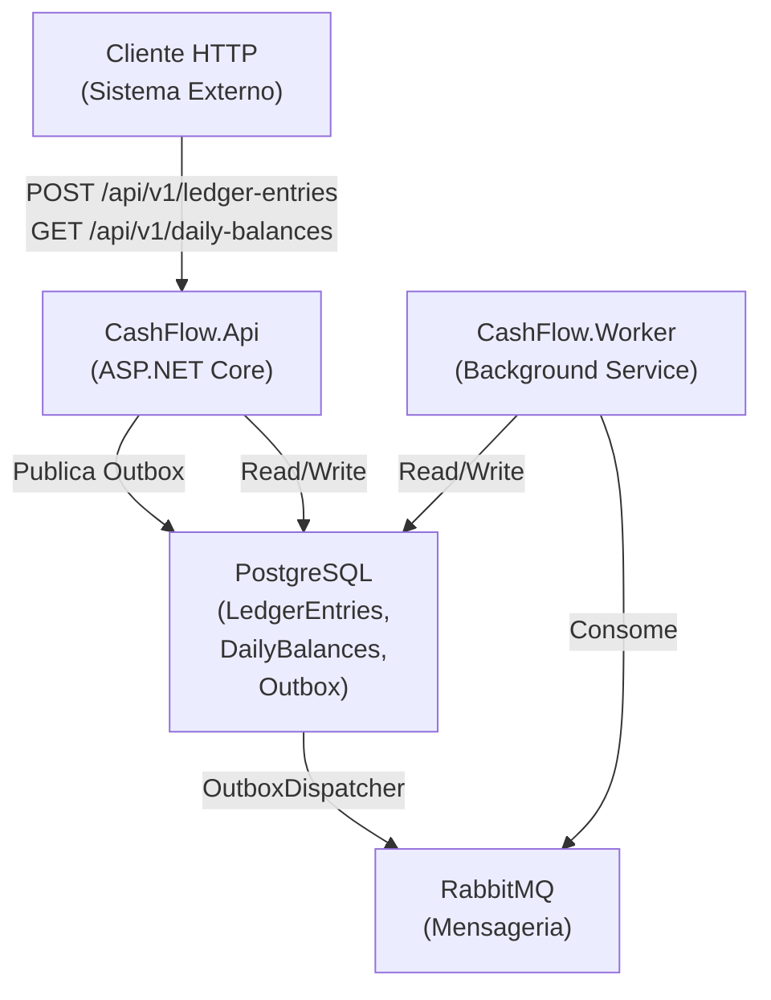
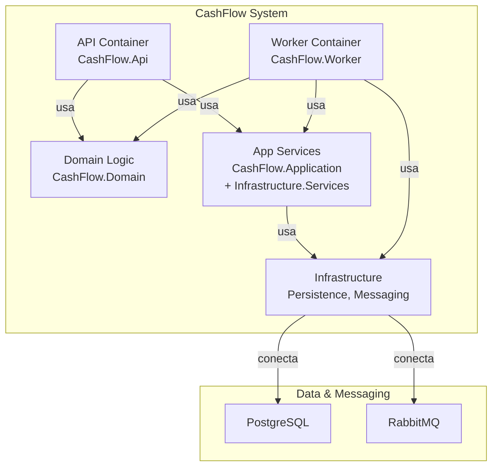
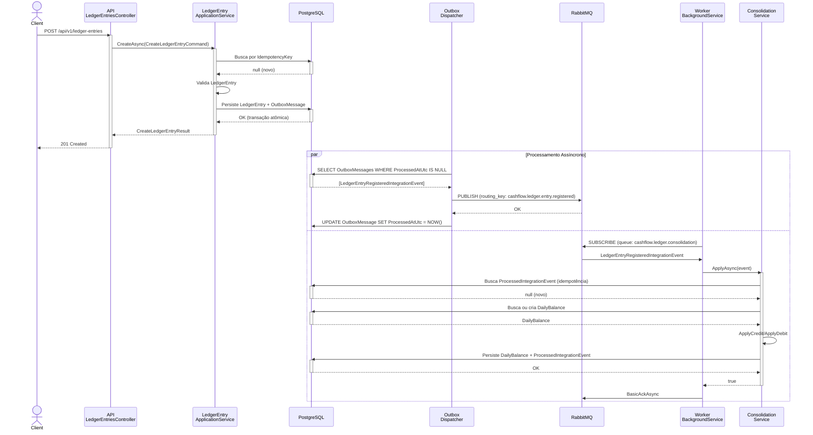

# Arquitetura da Solução CashFlow

## 1. Visão geral da solução

### Propósito
A solução **CashFlow** é uma aplicação distribuída de gerenciamento de fluxo de caixa diário que permite o registro de lançamentos (crédito/débito) com consolidação automática de saldos via processamento assíncrono. O sistema foi projetado para garantir **disponibilidade do serviço de lançamentos** mesmo durante falhas do consolidado diário, utilizando padrões de resiliência e mensageria assíncrona.

### Problema de negócio resolvido
- **Registro de lançamentos de débito/crédito** de forma confiável e com proteção contra duplicidade
- **Consolidação diária de saldos** calculados a partir dos lançamentos registrados
- **Desacoplamento entre operações síncronas e assíncronas** para garantir escalabilidade
- **Tolerância a falhas** no processamento do consolidado sem comprometer o serviço de lançamentos
- **Suporte a picos de carga** (50 req/s no consolidado com máximo 5% de perda)

### Principais módulos e responsabilidades

| Módulo | Responsabilidade |
|--------|-----------------|
| **CashFlow.Api** | Endpoints HTTP, versionamento, validação de request/response, autenticação (planejar) |
| **CashFlow.Worker** | Consumo de eventos via RabbitMQ, consolidação de saldos, retry automático |
| **CashFlow.Domain** | Entidades (LedgerEntry, DailyBalance), regras de negócio, validadores |
| **CashFlow.Application** | Casos de uso (CreateLedgerEntry, GetDailyBalance), orquestração |
| **CashFlow.Infrastructure** | Persistência (PostgreSQL), mensageria (RabbitMQ), Outbox pattern |
| **CashFlow.Migrations** | Versionamento do banco, execução de migrations EF Core |
| **CashFlow.AppHost** | Orquestração local com .NET Aspire (definição de containers) |

---

## 2. Estilo arquitetural

### Padrão adotado
A solução segue uma **arquitetura em camadas modular com separação de responsabilidades (MVC-like + DDD)**, combinando:

1. **Layered Architecture** (Camadas)
   - Apresentação (Controllers/API)
   - Aplicação (Application Services, Commands/Queries)
   - Domínio (Entidades, agregados, regras de negócio)
   - Infraestrutura (Persistência, mensageria, configurações)

2. **Domain-Driven Design (DDD)**
   - Entidades com comportamento (LedgerEntry, DailyBalance)
   - Validadores no domínio
   - Value Objects implícitos (não há classes específicas, mas o Enum `LedgerEntryType` é um VO)
   - Agregados implícitos (LedgerEntry é agregado por tabela, sem referência direta a DailyBalance)

3. **Event-Driven Architecture**
   - Eventos de integração (`LedgerEntryRegisteredIntegrationEvent`)
   - Padrão Outbox para garantir consistência transacional (exactly-once semantics)
   - Processamento assíncrono desacoplado via RabbitMQ

4. **Resiliência e Tolerância a Falhas**
   - Desacoplamento entre API e Worker
   - Retry automático no Outbox Dispatcher
   - Idempotência via `IdempotencyKey` no LedgerEntry e `ProcessedIntegrationEvent`

---

## 3. Decomposição por camadas

### Camada de apresentação (API)
- **Componentes**: `LedgerEntriesController`, `DailyBalancesController`, `WeatherForecastController`
- **Responsabilidades**:
  - Receber e validar requisições HTTP
  - Mapear DTOs para Commands/Queries
  - Orquestrar chamadas ao Application Service
  - Retornar respostas, tratamento de erros básico
- **Dependências**: Application Services, Validadores
- **Padrões**: RESTful com versionamento (`/api/v{version:apiVersion}/...`)

### Camada de aplicação
- **Interfaces**: `ILedgerEntryApplicationService`, `IDailyBalanceQueryService`
- **Implementações**: `LedgerEntryApplicationService`, `DailyBalanceQueryService`
- **Responsabilidades**:
  - Orquestrar lógica de caso de uso
  - Coordenar chamadas entre domínio e infraestrutura
  - Executar transações
  - Publicar eventos de integração
- **Dependências**: Domain, Infrastructure (Persistência, Mensageria)
- **Padrões**: Command/Query separation (CQS), Application Services

### Camada de domínio
- **Entidades**: `LedgerEntry`, `DailyBalance`
- **Value Objects**: `LedgerEntryType` (enum)
- **Validadores**: `LedgerEntryValidator`, `DailyBalanceValidator`
- **Regras de negócio**:
  - Lançamentos só podem ser credit ou debit
  - Valores devem ser > 0
  - Datas não podem ser no futuro
  - Chave de idempotência obrigatória
  - ApplyCredit()/ApplyDebit() em DailyBalance

### Camada de infraestrutura
- **Persistência**:
  - `CashFlowDbContext` (EF Core com PostgreSQL)
  - Configurations (LedgerEntryConfiguration, DailyBalanceConfiguration, OutboxMessageConfiguration, ProcessedIntegrationEventConfiguration)
  - Migrations automáticas via EF Core
  - Índices otimizados em chaves de acesso frequente
  
- **Mensageria**:
  - `RabbitMqPublisher` (publica eventos no Outbox)
  - `Worker` (background service que consome eventos)
  
- **Padrão Outbox**:
  - Tabela `outbox_messages`: armazena eventos não publicados
  - Tabela `processed_integration_events`: rastreia eventos já processados (idempotência)
  - `OutboxDispatcherBackgroundService`: processa a fila pendente a cada 3 segundos
  
- **Serviços**:
  - `LedgerEntryApplicationService`: persiste lançamento + cria outbox
  - `DailyBalanceQueryService`: query simples de saldo consolidado
  - `LedgerConsolidationService`: consome evento e atualiza DailyBalance

---

## 4. Fluxo de componentes

### Sequência: Criar lançamento
```
Cliente HTTP
    |
    v
LedgerEntriesController.Create(CreateLedgerEntryRequest)
    |
    v
LedgerEntryApplicationService.CreateAsync(CreateLedgerEntryCommand)
    |
    +-> LedgerEntryValidator.ValidateAsync(LedgerEntry)
    |   (valida: merchantId, type, amount, occurredAt, idempotencyKey)
    |
    +-> DbContext.LedgerEntries.FirstOrDefault (checar idempotência)
    |
    +-> DbContext.SaveChangesAsync (persiste LedgerEntry + OutboxMessage)
    |
    v
Resposta 201 Created
```

### Sequência: Consolidar saldo (assíncrono)
```
OutboxDispatcherBackgroundService (a cada 3s)
    |
    v
DbContext.OutboxMessages.Where(ProcessedAtUtc == null).Take(50)
    |
    v
RabbitMqPublisher.PublishAsync(RoutingKey, Payload)
    |
    v
RabbitMQ Exchange/Queue
    |
    v
Worker (BackgroundService)
    |
    +-> Consome mensagem da fila RabbitMQ
    |
    +-> LedgerConsolidationService.ApplyAsync(LedgerEntryRegisteredIntegrationEvent)
    |   +-> Valida se evento já foi processado
    |   +-> Encontra ou cria DailyBalance
    |   +-> ApplyCredit() ou ApplyDebit()
    |   +-> Valida DailyBalance
    |   +-> Registra ProcessedIntegrationEvent (idempotência)
    |
    +-> BasicAckAsync (RabbitMQ)
    |
    v
Saldo consolidado atualizado
```

### Sequência: Consultar saldo diário
```
Cliente HTTP
    |
    v
DailyBalancesController.Get(merchantId, date)
    |
    v
DailyBalanceQueryService.GetAsync(GetDailyBalanceQuery)
    |
    v
DbContext.DailyBalances.FirstOrDefault(merchantId, date)
    |
    v
DailyBalanceDto
    |
    v
Resposta 200 OK ou 404 Not Found
```

---

## 5. Pontos de acoplamento

| Ponto | Tipo | Nível | Mitigação |
|-------|------|-------|-----------|
| Controller → ApplicationService (Dependency Injection) | Acoplamento normal | ALTO | Interface `ILedgerEntryApplicationService` |
| ApplicationService → DbContext | Acoplamento EF Core | ALTO | Abstração via Repository (não implementada, usar UnitOfWork) |
| OutboxDispatcher → RabbitMQ | Acoplamento direto | MÉDIO | Abstração `IRabbitMqPublisher` já existe |
| Worker → RabbitMQ | Acoplamento direto | MÉDIO | Resilience (retry, requeue via RabbitMQ) |
| Domain Validadores → FluentValidation | Acoplamento externo | BAIXO | Inversão de dependência já implementada |

---

## 6. Dependências externas

### Tecnologias e pacotes principais

```
.NET 10.0
├── ASP.NET Core
│   ├── Swagger/OpenAPI
│   ├── API Versioning (Asp.Versioning)
│   └── ProblemDetails (error handling)
├── Entity Framework Core 10.0.5
│   ├── Npgsql (PostgreSQL)
│   └── InMemory (testes)
├── RabbitMQ.Client 7.2.1
├── Aspire 13.2.0 (orchestration local)
├── FluentValidation 11.9.2 (validação de domínio)
├── OpenTelemetry 1.15.0 (observabilidade)
├── xUnit 2.9.3 (testes unitários)
├── Bogus 35.6.1 (geração de dados testes)
└── FluentAssertions 6.12.1 (assertions testes)
```

### Recursos externos em runtime

| Recurso | Propósito | Configuração |
|---------|----------|--------------|
| PostgreSQL 16 | Persistência de domínio | `ConnectionStrings__cashflowdb` |
| RabbitMQ 3 | Mensageria assíncrona | Host: rabbitmq, Keyed client |
| Aspire Dashboard (dev) | Orquestração local | Port 15297 |
| OpenTelemetry (opcional) | Tracing/Metrics | Exportador OTLP configurável |

---

## 7. Diagramas da arquitetura

### Diagrama de Contexto (C4)


### Diagrama de Containers  (C4)


### Diagrama de Fluxo: Lançamento → Consolidação


### Diagrama de Fluxo: Query de Saldo
```mermaid
graph LR
    Client["Cliente"]
    Controller["DailyBalancesController"]
    QueryService["DailyBalanceQueryService"]
    DB["PostgreSQL"]
    DTO["DailyBalanceDto"]
    
    Client -->|GET /api/v1/daily-balances<br/>?merchantId={guid}&date={date}| Controller
    Controller -->|GetAsync(GetDailyBalanceQuery)| QueryService
    QueryService -->|FirstOrDefault<br/>(merchantId, date)| DB
    DB -->|DailyBalance ou null| QueryService
    QueryService -->|map| DTO
    Controller -->|200 OK ou 404| Client
```

---

## 8. Arquitetura de dados

### Esquema do banco de dados

```sql
-- Lançamentos (ledger_entries)
CREATE TABLE ledger_entries (
    id UUID PRIMARY KEY,
    merchant_id UUID NOT NULL,
    type INT NOT NULL,  -- 1: Credit, 2: Debit
    amount DECIMAL(18,2) NOT NULL,
    occurred_at_utc TIMESTAMP NOT NULL,
    description VARCHAR(500),
    idempotency_key VARCHAR(256) UNIQUE NOT NULL
);

-- Saldos consolidados (daily_balances)
CREATE TABLE daily_balances (
    id UUID PRIMARY KEY,
    merchant_id UUID NOT NULL,
    date DATE NOT NULL,
    balance DECIMAL(18,2) NOT NULL,
    updated_at_utc TIMESTAMP NOT NULL,
    UNIQUE(merchant_id, date)
);

-- Fila Outbox (outbox_messages)
CREATE TABLE outbox_messages (
    id UUID PRIMARY KEY,
    type VARCHAR(200) NOT NULL,
    routing_key VARCHAR(200) NOT NULL,
    payload TEXT NOT NULL,
    occurred_at_utc TIMESTAMP NOT NULL,
    processed_at_utc TIMESTAMP,  -- NULL = pendente
    attempts INT NOT NULL,
    last_error VARCHAR(2000)
);

-- Rastreamento de eventos (processed_integration_events)
CREATE TABLE processed_integration_events (
    id UUID PRIMARY KEY,
    event_id VARCHAR(256) UNIQUE NOT NULL,
    processed_at_utc TIMESTAMP NOT NULL
);
```

### Índices

| Tabela | Índice | Motivo |
|--------|--------|--------|
| ledger_entries | IX_LedgerEntry_MerchantId | Queries por merchant |
| ledger_entries | IX_LedgerEntry_OccurredAtUtc | Queries por período |
| ledger_entries | IX_LedgerEntry_IdempotencyKey (UNIQUE) | Detecção de duplicidade |
| ledger_entries | IX_LedgerEntry_MerchantId_OccurredAtUtc | Queries combinadas |
| daily_balances | IX_DailyBalance_MerchantId | Queries por merchant |
| daily_balances | IX_DailyBalance_Date | Queries por data |
| daily_balances | IX_DailyBalance_MerchantId_Date (UNIQUE) | Garantir unicidade |
| outbox_messages | processed_at_utc | Filtrar pendentes |
| processed_integration_events | event_id (UNIQUE) | Idempotência |

---

## 9. Padrões e princípios aplicados

### Padrões de Design

| Padrão | Onde | Como |
|--------|------|------|
| **Outbox Pattern** | Infrastructure.Outbox | Garante exactly-once semantics entre DB e RabbitMQ |
| **Idempotency Key** | LedgerEntry, ProcessedIntegrationEvent | Evita duplicidade em retries |
| **Background Service** | Worker, OutboxDispatcher | Processamento assíncrono desacoplado |
| **Dependency Injection** | Program.cs, DependencyInjection.cs | IoC container padrão .NET |
| **Repository Pattern** (parcial) | DbContext simples | Abstração de persistência (pode melhorar) |
| **Command/Query Separation** | CreateLedgerEntryCommand, GetDailyBalanceQuery | Separação clara de read/write |
| **Validator Pattern** | LedgerEntryValidator, DailyBalanceValidator | Validação centralizada no domínio |

### Princípios SOLID

| Princípio | Status | Detalhe |
|-----------|--------|---------|
| **S**ingle Responsibility | ✅ Atendido | Controllers, Services, Validators têm responsabilidade única |
| **O**pen/Closed | ⚠️ Parcial | Extensível via Dependency Injection, mas caberia Strategy para diferentes tipos de consolidação |
| **L**iskov Substitution | ✅ Atendido | Interfaces bem definidas (ILedgerEntryApplicationService, IDailyBalanceQueryService) |
| **I**nterface Segregation | ✅ Atendido | Interfaces pequenas e focadas |
| **D**ependency Inversion | ✅ Atendido | Dependências injetadas via IoC container |

---

## 10. Ciclo de vida da aplicação

### Inicialização
1. **Program.cs (API)**: Configura Aspire, DI, OpenTelemetry, DbContext, Swagger
2. **Program.cs (Worker)**: Configura Aspire, DI, DbContext, Application Services
3. **migrations**: Executa EF Core migrations (já deve estar no AppHost)
4. **Health Checks**: Mapeados em `/health` e `/alive` (desenvolvimento)

### Runtime
- **API**: Recebe requisições HTTP, valida, chama ApplicationServices
- **OutboxDispatcher**: A cada 3 segundos, processa mensagens pendentes
- **Worker**: Consome eventos de RabbitMQ continuamente
- **OpenTelemetry**: Exporta traces/metrics (se configurado)

### Parada
- **API**: Garante conclusão de requisições em progresso
- **Worker**: Aguarda cancelação (token), finaliza conexão RabbitMQ
- **OutboxDispatcher**: Aguarda cancelação, garante lastro de tentativas

---

## 11. Observabilidade e monitoramento

### Health Checks
- **Self health check**: `/health` e `/alive` (mapeados somente em desenvolvimento)
- Não há health checks explícitos para RabbitMQ ou PostgreSQL em produção (oportunidade de melhoria)

### Logging
- **Estruturado via OpenTelemetry**: Logs com escopo e mensagens formatadas
- **Nivéis**: Console + Debug em dev; configurável para OTLP/Jaeger em prod
- **Aplicações**: Logs detalhados em Worker, Migrations, Outbox Dispatcher

### Tracing (quando configurado OTLP)
- OpenTelemetry instrumenta HTTP (ASP.NET Core) e banco de dados (EF Core)
- Métricas: Request duration, query execution, RabbitMQ publish/consume latency

### Métricas (quando configurado OTLP)
- ASP.NET Core: Request count, duration, status codes
- HTTP Client: Request duration, errors
- Runtime: Memory, GC, thread pool

---

## 12. Decisões arquiteturais-chave

1. **Outbox Pattern vs. Sagas**: Escolheu Outbox pelo simplismo e garantia ACID em uma transação
2. **RabbitMQ vs. Kafka**: RabbitMQ para menor latência e overhead (consolidado em 3s é aceitável)
3. **PostgreSQL vs. SQL Server**: Cross-platform, open-source, Aspire nativo
4. **EF Core vs. Dapper**: EF para abstração e migrations automáticas
5. **Processamento a cada 3s vs. Real-time**: Trade-off: latência aceitável vs. simplicidade operacional

---

## 13. Limitações e trade-offs atuais

| Limitação | Impacto | Mitigação recomendada |
|-----------|--------|----------------------|
| Sem autenticação/autorização | Endpoint público, não seguro em produção | OAuth2/JWT + autorização por merchant |
| Outbox a cada 3 segundos | Latência até 3s entre lançamento e consolidação | Message broker com confirmação imediata ou Saga pattern |
| Sem cache de saldos | Query sempre hit DB | Redis ou in-memory cache com invalidação |
| Limite de 50 mensagens por lote | Pode perder messages sob pico 50 req/s | Aumentar batch size ou escalabilidade horizontal |
| Sem circuit breaker RabbitMQ | Falhas prolongadas podem acumular tentativas | Polly + Circuit Breaker |
| Health checks limitados | Visibilidade baixa em produção | Adicionar DB/RabbitMQ checks + Prometheus |

---

## Conclusão

A arquitetura da solução CashFlow é **robusta e bem-estruturada** para o caso de uso do desafio:
- ✅ Camadas claras e bem separadas
- ✅ Padrões de resiliência implementados (Outbox, idempotência)
- ✅ Domínio rico com validações
- ✅ Desacoplamento entre lançamento e consolidação
- ✅ Tecnologias modernas e escaláveis

Principais áreas de evolução:
- 🔄 Adicionar autenticação/autorização
- 🔄 Implementar circuit breaker e retry policies mais sofisticadas
- 🔄 Melhorar observabilidade (health checks, métricas específicas)
- 🔄 Abstrair DbContext via padrão Repository/UnitOfWork
- 🔄 Adicionar caching estratégico
